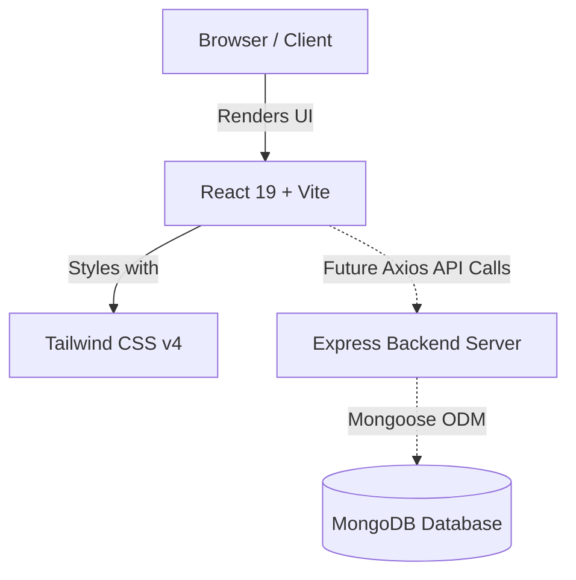

# 🎓 College ERP Dashboard

Full-stack College ERP: authentication & RBAC, academic modules (attendance, exams & results, timetable, curriculum, workload), finance, admissions, notifications (Socket.IO), exports, analytics, Google SSO, Redis caching, and a background job queue.

A beginner-friendly **MERN** (MongoDB, Express, React, Node.js) administrative dashboard designed for educational institutions.

---

## 📚 Documentation Hub

Explore the documentation tailored for first-year students and new contributors:

| Guide | Description | Key Focus |
| :--- | :--- | :--- |
| 🚀 [Getting Started](docs/getting-started.md) | Setup & installation guide | Local environment, Vite dev server, npm scripts |
| 🏗️ [Project Architecture](docs/project-architecture.md) | High-level system design | Client-server architecture, data flow, tech stack |
| 📁 [Folder & File Guide](docs/folder-structure.md) | File-by-file breakdown | Purpose, dependencies, common mistakes per file |
| 🧩 [Component Guide](docs/components.md) | React component reference | Props, state, code snippets, beginner pitfalls |
| 🗺️ [Learning Path](docs/learning-path.md) | 7-Day progression plan | Daily checklist, key concepts, visual learning flow |
| 🛠️ [Debugging Guide](docs/debugging.md) | Common errors & solutions | Step-by-step troubleshooting, error fixes |
| ✏️ [Beginner Exercises](docs/exercises.md) | Hands-on practice tasks | Safe exercises with collapsible hints |
| 🎯 [Development Roadmap](docs/roadmap.md) | Logical build sequence | Project status, upcoming milestones, feature plan |

---

## 🛠️ Tech Stack Overview

| Area | Technology | Purpose |
| :--- | :--- | :--- |
| **Frontend Framework** | React 19 | Component-based UI rendering |
| **Build Tool** | Vite 8 | Ultra-fast development server & bundler |
| **Styling** | Tailwind CSS v4 | Utility-first responsive CSS styling |
| **Backend** | Node.js + Express 5 | RESTful API web server |
| **Database** | MongoDB + Mongoose 9 | Document database & object modeling |
| **Authentication** | JWT + bcryptjs | Secure user authorization & password hashing |
| **Realtime** | Socket.IO | Live notifications & updates |
| **Caching** | Redis (ioredis) | Server-side caching & job queue |
| **Charts** | Recharts | Dashboard analytics visualizations |

---

## ⚡ Quick Start (Dev)

### 1. Server
```bash
cd server
cp .env.example .env      # fill in MONGO_URI, JWT_SECRET, ...
npm install
npm run dev               # http://localhost:5000  (Swagger at /api-docs)
```

### 2. Client (separate terminal)
```bash
cd client
npm install
npm run dev               # http://localhost:5173 (proxies /api and /socket.io to :5000)
```

### 3. Seed an admin (optional)
```bash
cd server && npm run seed:admin
```

Default login (after seeding): the email/password set via `ADMIN_EMAIL` / `ADMIN_PASSWORD` in `server/.env`.

---

## Tests

```bash
cd server && npm test     # Node test runner + supertest + mongodb-memory-server
```

## Data migrations & indexes

- `npm run migrate` (dry run) / `npm run migrate:apply` — one-time data migration (admins → users, ObjectId refs, drop manual counters).
- `npm run indexes` — ensure all Mongoose schema indexes exist in the database. Indexes are also ensured automatically at startup when `NODE_ENV=production`.

## Environment variables

See `server/.env.example` for the full list. Required: `MONGO_URI`, `JWT_SECRET`, `JWT_EXPIRE`. Optional but recommended in production: `REFRESH_TOKEN_SECRET`, `REDIS_URL`, Google SSO vars, `LOCKOUT_*`, `PASSWORD_*`.

---

## 🐳 Docker Deployment

Runs MongoDB + Redis + API + web (nginx serving the built client and proxying `/api`, `/api-docs`, `/socket.io`) with one command:

```bash
cp server/.env.example .env   # root .env — set JWT_SECRET (required by compose), MONGO_URI override if needed
docker compose up -d --build
# Web:      http://localhost
# API:      http://localhost/api/v1
# Swagger:  http://localhost/api-docs
```

By default the container uses the bundled MongoDB/Redis. For MongoDB Atlas, set `MONGO_URI` in the root `.env` and remove/replace the `mongo` service in `docker-compose.yml`.

### Deploying to a cloud host

The `client` and `server` images are standard. Build and push them to a registry, then run on any container host (Render, Railway, Fly.io, ECS):

```bash
docker build -t erp-server ./server
docker build -t erp-client ./client
```

Point the images at a managed MongoDB/Redis and set the same environment variables from `server/.env.example`.

---

## 💾 Backups & Disaster Recovery

- **MongoDB Atlas** — enable the built-in cloud backup schedule (continuous or daily snapshots) in Atlas → Backups. Restore via the Atlas UI or `mongorestore`.
- **Self-hosted MongoDB** — the `mongo` container persists to the `mongo_data` volume. Back it up with `mongodump --uri "$MONGO_URI" --out backups/$(date +%F)` and schedule it via cron.
- **Redis** — a cache only; Redis data is not authoritative. Losing it just drops cached stats / in-flight jobs, which regenerate.
- **Disaster recovery procedure**
  1. Stand up a new server/container with the same environment variables.
  2. Restore the latest Mongo dump/backup into the new instance.
  3. Run `npm run migrate:apply` then `npm run indexes` (idempotent).
  4. Seed an admin if needed (`npm run seed:admin`).
  5. Verify: web loads, `/api-docs` opens, login works.

---

## 📖 API Documentation

Swagger UI is served at `/api-docs` with the full OpenAPI 3.0 spec (`server/docs/swagger.js`).

---

## 🏗️ High-Level System Architecture



---

## 📅 What Should I Learn Today?

> [!TIP]
> Check your progress using our interactive daily learning tracker!
> - [ ] **Day 1**: Environment setup & running Vite dev server ([Guide](docs/getting-started.md))
> - [ ] **Day 2**: React JSX & Component basics ([Guide](docs/components.md))
> - [ ] **Day 3**: Props & Layout structure ([Guide](docs/folder-structure.md))
> - [ ] **Day 4**: Tailwind CSS grid & flexbox styling ([Guide](docs/learning-path.md))
> - [ ] **Day 5**: Client-side routing ([Guide](docs/roadmap.md))
> - [ ] **Day 6**: Express API endpoints ([Guide](docs/project-architecture.md))
> - [ ] **Day 7**: Full-stack integration ([Guide](docs/exercises.md))

---

## 🤝 Guidelines 

1. **Kuch bhi kharab ho tension mat lena** — Git lets you undo changes easily!
2. **Agar kabhi error ai to use terminal or browser console pe dekhna or naa samajh ai to ChatGPT se puuchna** before guessing.
3. **Documentation dekh lena sahi se`/docs`** whenever you encounter a new concept or file.

**Or firbhi kuch na ho to puch lena**
